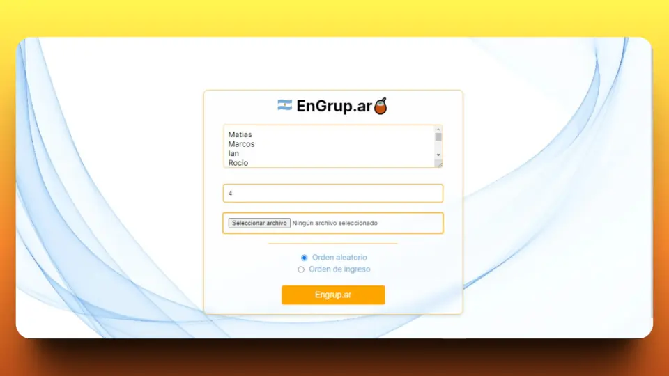
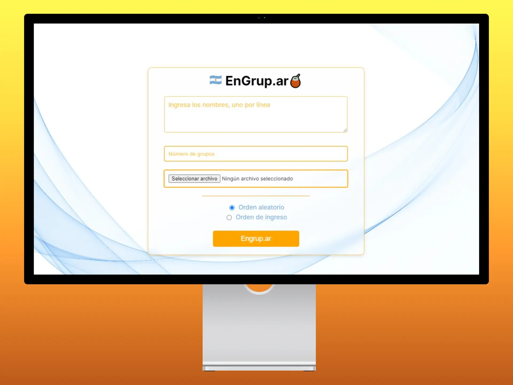

# engrup.ar

Engrup.ar es un software que permite al usuario formar grupos de personas de manera simple y eficaz, ingrese los nombres con el número de grupos y listo.

## Screenshots

## Authors

- Grupo 2 > Grupo 1
- El grupo 1 puro Chat GPT

